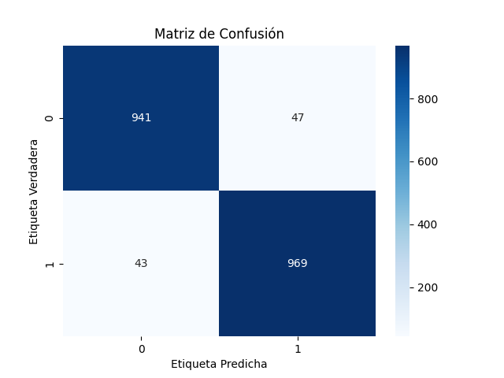

## README

# Proyecto de Detección de Phishing URLs

Este proyecto tiene como objetivo desarrollar un sistema para detectar URLs de phishing utilizando un modelo de clasificación. El sistema está implementado en Python y utiliza una aplicación web con Streamlit para realizar las predicciones.

## Requisitos

- Python 3.10
- Paquetes especificados en `requirements.txt`

## Estructura del Proyecto

- `UrlValidator.py`: Clase que valida y extrae características de las URLs.
- `train_model.py`: Script para entrenar el modelo de detección de phishing.
- `app_project.py`: Aplicación web en Streamlit para predecir si una URL es phishing o legítima.
- `Phishing_Legitimate_full.csv`: Conjunto de datos utilizado para entrenar el modelo.
- `url-model.pkl`: Modelo entrenado guardado.
- `requirements.txt`: Archivo con las dependencias necesarias para ejecutar el proyecto.

## Instalación en Local

1. Clona este repositorio en tu máquina local.
   ```bash
   git clone https://github.com/Ssnati/Final-Project-IC.git
   cd Final-Project-IC
   ```

2. Crea un entorno virtual.
   ```bash
   python -m venv env
   ```

3. Activa el entorno virtual.

   - En Windows:
     ```bash
     .\env\Scripts\activate
     ```
   - En MacOS/Linux:
     ```bash
     source env/bin/activate
     ```

4. Instala las dependencias.
   ```bash
   pip install -r requirements.txt
   ```

## Entrenamiento del Modelo

Si deseas entrenar el modelo desde cero, sigue estos pasos:

1. Asegúrate de tener el archivo `Phishing_Legitimate_full.csv` en el directorio del proyecto.

2. Ejecuta el script de entrenamiento.
   ```bash
   python train_model.py
   ```

Este script cargará los datos, entrenará un modelo de RandomForestClassifier y guardará el modelo entrenado en `url-model.pkl`.

Este genera una imagen de la matriz de confusion


## Uso de la Aplicación Web

Para ejecutar la aplicación web y realizar predicciones en URLs:

1. Asegúrate de que el archivo `url-model.pkl` esté en el directorio del proyecto. Si no, entrena el modelo siguiendo las instrucciones anteriores.

2. Ejecuta la aplicación de Streamlit.
   ```bash
   streamlit run app_project.py
   ```

3. Abre tu navegador web y navega a `http://localhost:8501` para acceder a la aplicación.

## Estructura de los Archivos

- **UrlValidator.py**: Contiene la clase `UrlValidator` que extrae características de las URLs.
- **train_model.py**: Script que entrena el modelo de detección de phishing.
- **app_project.py**: Script que inicia la aplicación de Streamlit.
- **Phishing_Legitimate_full.csv**: Archivo CSV con los datos utilizados para entrenar el modelo.
- **url-model.pkl**: Archivo con el modelo entrenado.
- **requirements.txt**: Archivo de texto con las dependencias necesarias.

## Contribuciones

Las contribuciones son bienvenidas. Para contribuir, por favor sigue estos pasos:

1. Haz un fork del repositorio.
2. Crea una nueva rama (`git checkout -b feature/nueva_caracteristica`).
3. Realiza los cambios necesarios y haz commit (`git commit -am 'Añadir nueva característica'`).
4. Envía los cambios a la rama original (`git push origin feature/nueva_caracteristica`).
5. Crea una solicitud de pull.

## Autores

Este proyecto fue hecho por *Thomas Sorza* y *Santiago Orjuela*.
